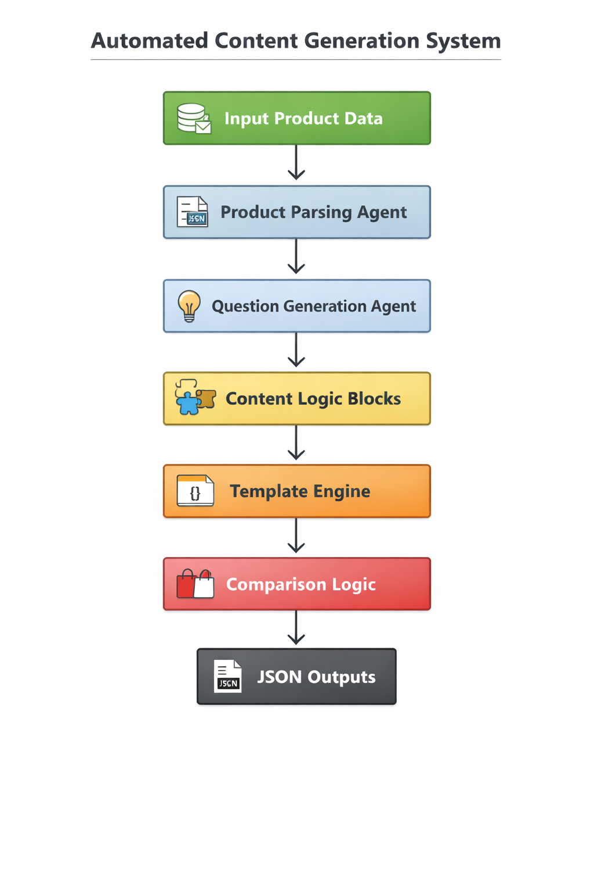

# Multi-Agent Content Generation System
#1.Problem Statement
The objective of this project is to design and implement a modular, agent-based automation system that transforms a fixed product dataset into structured, machine-readable content pages.
The system must:
- operate only on provided input data
- avoid monolithic scripts
- demonstrate clear agent boundaries
- generate deterministic JSON outputs
- resemble production-style automation rather than prompt-based generation
This assignment evaluates system design, orchestration, abstraction, and composability rather than domain knowledge or content creativity.
#2.Solution Overview
The solution is implemented as a multi-agent pipeline where each agent has a single responsibility and communicates only through explicit inputs and outputs.
The system processes a product dataset through:
1. Parsing and normalization
2. Question generation
3. Reusable content logic blocks
4. Template-based page assembly
5. Orchestrated execution producing final JSON artifacts
The entire flow is deterministic, modular, and extensible.
#3.Scope&Assumptions
#Scope
- The system operates on structured product data of similar schema
- Output pages are machine-readable JSON only
- Content generation is rule-based and deterministic
#Assumptions
- No external data sources or research are used
- Product B in comparison is fictional and explicitly marked as such
- The system focuses on engineering design, not UI or language creativity
#4. System Design (Core Section)
#4.1 Architecture Overview
The system follows a step-based orchestration pipeline controlled by a central Orchestrator Agent.
High-level flow:
Input Data  
→ Product Parsing Agent  
→ Question Generation Agent  
→ Content Logic Blocks  
→ Template Engine  
→ Comparison Logic  
→ JSON Outputs  
Each step is isolated, stateless, and independently testable.
#4.2 Agent Responsibilities
#Product Parsing Agent
- Validates and normalizes raw input data
- Converts input into a canonical internal Product Model
- Acts as the single source of truth for downstream agents
#Question Generation Agent
- Automatically generates categorized user questions
- Categories include informational, usage, safety, pricing, and comparison
- Output is deterministic and derived strictly from product data
#Content Logic Blocks
Reusable functional modules that transform product data into structured content fragments.
Examples:
- Benefits block
- Usage block
- Safety block
- Pricing block
- Comparison block
These blocks are stateless, composable, and reusable across templates.
#Template Engine Agent
- Defines structured templates for each output page
- Specifies required fields and dependencies on content blocks
- Assembles final page structures without embedding business logic
#Comparison Logic Agent
- Creates a clearly fictional Product B with the same schema
- Performs structured comparison between Product A and Product B
- Ensures schema consistency and transparency
#Orchestrator Agent
- Controls the execution flow of the entire system
- Calls agents in a predefined sequence
- Assembles and writes final JSON outputs
- No agent calls another agent directly
#4.3 Orchestration Flow
The orchestration follows a linear, deterministic pipeline:
1. Load input product data
2. Parse and normalize into Product Model
3. Generate categorized questions
4. Generate reusable content blocks
5. Create fictional comparison product
6. Assemble pages using templates
7. Output JSON artifacts
This design can be extended into a DAG or workflow engine if required.
### System Orchestration Flow Diagram

#5. Output Artifacts
The system autonomously generates the following machine-readable outputs:
- faq.json  
- product_page.json  
- comparison_page.json  
Each output adheres to a structured JSON schema with no free-form text.
#6. Design Rationale
This system prioritizes:
- clear separation of concerns
- agent-level abstraction
- deterministic automation
- extensibility without refactoring core logic
The architecture mirrors production-grade content automation systems rather than prompt-driven scripts.
#7. Extensibility
The system can be extended by:
- adding new templates without modifying agents
- introducing new content blocks
- replacing the orchestrator with a DAG-based engine
- supporting additional product schemas
No architectural changes are required for these extensions.